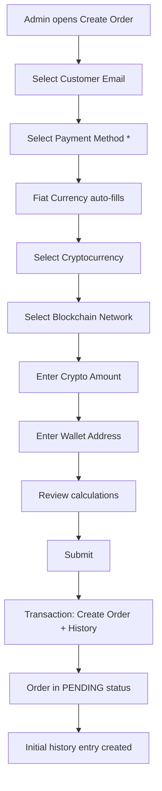

# 🎯 Order Creation & Payment Method Improvements

## ✅ Реализовано

### 1. **Payment Method Integration в Order Creation**

#### Изменения в схеме:
```prisma
model Order {
  paymentMethodCode String?
  paymentMethod PaymentMethod? @relation(fields: [paymentMethodCode], references: [code])
  // Связь уже существовала
}
```

#### Валидация (обязательное поле):
```typescript
// src/lib/validations/admin-order.ts
export const createAdminOrderSchema = z.object({
  userEmail: z.string().email('Invalid email'),
  paymentMethodCode: z.string().min(1, 'Payment method is required'), // REQUIRED
  currencyCode: z.enum(['BTC', 'ETH', 'USDT', 'SOL']),
  fiatCurrencyCode: z.enum(['EUR', 'PLN']),
  blockchainCode: z.string().optional(),
  // ...
});
```

---

### 2. **UI Improvements в CreateOrderDialog**

#### Позиционирование полей:
```
1. Customer Email * (Combobox)
2. Payment Method * (Combobox) ← NEW: Required, moved here
3. [Separator]
4. Cryptocurrency *
5. Fiat Currency * (auto-filled, disabled)
6. Blockchain Network *
7. Exchange Rate
8. Crypto Amount
9. Wallet Address
10. Admin Notes
```

#### Smart Payment Method Selection:
```typescript
<Combobox
  options={paymentMethods
    .filter(method => {
      // ✅ Filter by isActive
      // ✅ Filter by direction (IN for BUY, OUT for SELL)
      const direction = orderType === 'BUY' ? ['IN', 'BOTH'] : ['OUT', 'BOTH'];
      return method.isActive && direction.includes(method.direction);
    })
    .map(method => ({
      value: method.code,
      label: method.name,
      description: `${method.currency} - ${method.direction}`
    }))}
  onValueChange={(value) => {
    setValue('paymentMethodCode', value);
    // ✅ Auto-fill fiat currency
    const selectedMethod = paymentMethods.find(m => m.code === value);
    if (selectedMethod) {
      setValue('fiatCurrencyCode', selectedMethod.currency as 'EUR' | 'PLN');
    }
  }}
/>
```

#### Fiat Currency Auto-Fill:
```typescript
<Combobox
  value={watchedFields.fiatCurrencyCode}
  disabled={!!watchedFields.paymentMethodCode} // Disabled when method selected
/>
{watchedFields.paymentMethodCode && (
  <p className="text-xs text-muted-foreground">
    <Info /> Auto-filled from Payment Method
  </p>
)}
```

---

### 3. **Order History на создание**

#### API Changes:
```typescript
// src/app/api/admin/orders/create-for-client/route.ts
const order = await prisma.$transaction(async (tx) => {
  // Create order
  const newOrder = await tx.order.create({
    data: {
      userId, currencyCode, fiatCurrencyCode,
      paymentMethodCode, // ✅ Now saved
      blockchainCode,    // ✅ Now saved
      status: 'PENDING',
      createdByAdmin: true,
      // ...
    }
  });

  // ✅ Create initial status history entry
  await tx.orderStatusHistory.create({
    data: {
      orderId: newOrder.id,
      oldStatus: 'PENDING',
      newStatus: 'PENDING',
      changedBy: adminId,
      note: `Order created by admin${adminNotes ? `: ${adminNotes}` : ''}`
    }
  });

  return newOrder;
});
```

#### История заказа с момента создания:
```
OrderStatusHistory:
- orderId: order.id
- oldStatus: 'PENDING' (initial)
- newStatus: 'PENDING'
- changedBy: adminId (who created)
- changedAt: order.createdAt (timestamp)
- note: "Order created by admin: [optional notes]"
```

---

### 4. **Smart Kanban Transitions (из предыдущего коммита)**

#### PENDING → PAYMENT_PENDING:
- Показывает диалог для сбора PayIn данных
- Создаёт `PayIn` запись
- Обновляет статус
- Записывает в историю

#### PROCESSING → COMPLETED:
- Показывает диалог для сбора PayOut данных
- Создаёт `PayOut` запись с transaction hash
- Обновляет статус на COMPLETED
- Записывает в историю

---

## 🔄 Workflow создания заказа



### Детали:

1. **Customer Email**: Combobox с поиском по email, только KYC approved users
2. **Payment Method**: 
   - Фильтр по `isActive = true`
   - Фильтр по direction (IN для BUY, OUT для SELL)
   - При выборе → auto-fill Fiat Currency
3. **Fiat Currency**: 
   - Auto-filled from Payment Method
   - Disabled если метод выбран
   - Hint: "Auto-filled from Payment Method"
4. **Blockchain Network**: Фильтр по выбранной криптовалюте
5. **Exchange Rate**: Real-time от CoinGecko, можно переопределить
6. **Submit**: Atomic transaction (Order + OrderStatusHistory)

---

## 📊 Database Relations

```
Order
  ├─ paymentMethodCode → PaymentMethod (NEW: now saved on creation)
  ├─ blockchainCode → BlockchainNetwork (NEW: now saved on creation)
  ├─ fiatCurrencyCode → FiatCurrency (auto-filled from payment method)
  ├─ currencyCode → Currency
  ├─ userId → User
  └─ statusHistory → OrderStatusHistory[]
       └─ Initial entry created on order creation
```

---

## ✅ Benefits

### 1. **Data Integrity**
- Payment method сохраняется с момента создания
- Fiat currency всегда соответствует payment method
- История полная с момента создания

### 2. **Better UX**
- Меньше полей для заполнения (auto-fill)
- Только активные методы показываются
- Визуальная индикация auto-filled полей
- Предотвращение ошибок валюты

### 3. **Traceability**
- Полная история с момента создания
- Зафиксирован метод оплаты
- Зафиксирован blockchain network
- Admin actions логируются

### 4. **Business Logic**
- Только активные методы доступны
- Direction проверяется (IN/OUT/BOTH)
- Курс фиксируется на момент создания
- Комиссия рассчитывается правильно

---

## 🎯 Next Steps (Optional)

### 1. **Order History Display**
- GET `/api/admin/orders/[id]/history`
- Display in OrderDetailsSheet
- Timeline UI component

### 2. **Payment Method Changes**
- Allow changing payment method during order lifecycle
- Track changes in history
- Validate currency compatibility

### 3. **Notifications**
- Email to customer on order creation
- Payment instructions based on selected method
- Status change notifications

---

## 🔗 Related Commits

1. `4b512df` - Payment Method and Reference via Combobox
2. `93cfbcf` - Smart Kanban with PayIn/PayOut creation
3. `a91e798` - Smart Payment Method with isActive check and Fiat Currency auto-fill

---

**Status:** ✅ Complete and working!

