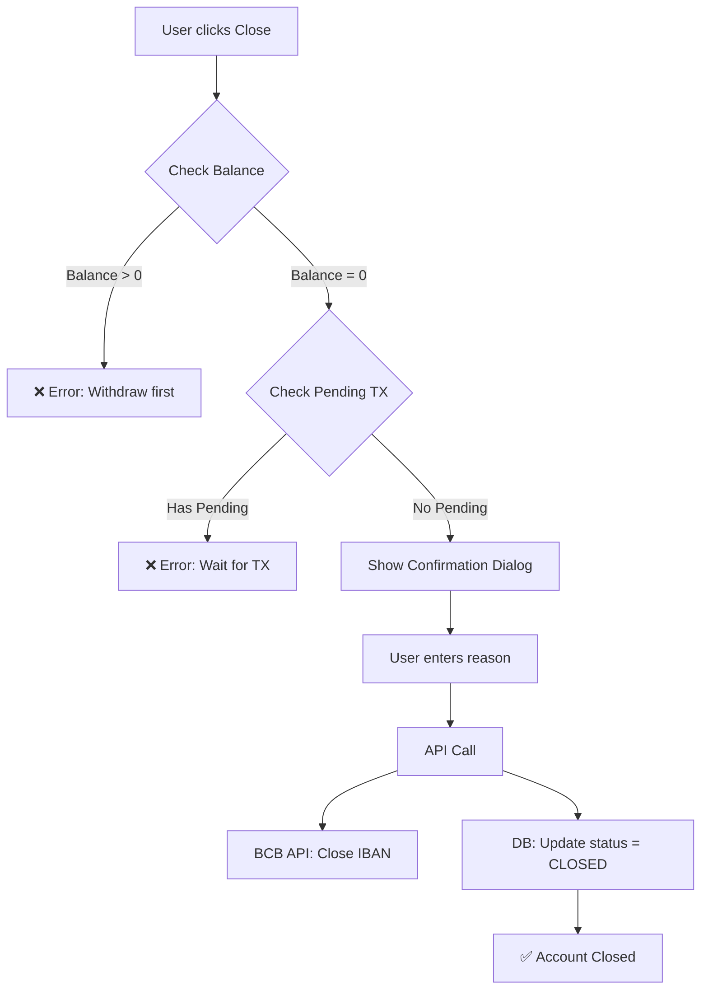
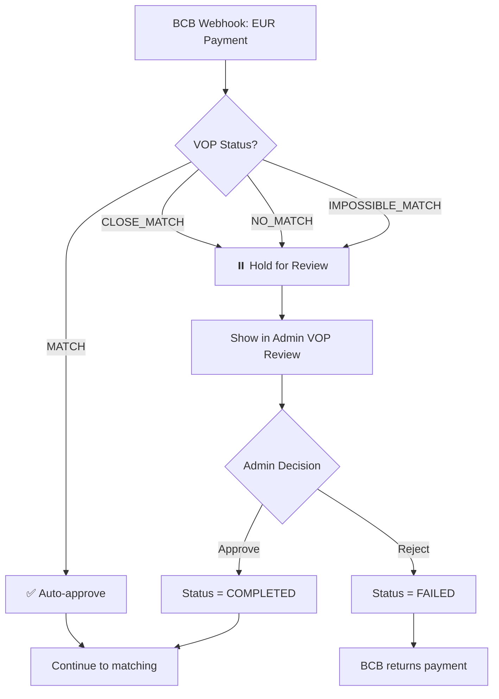

# Virtual IBAN: Close Account & VOP Features

## ✅ Реализовано

### 1. **Close Account (Закрытие счёта)**

#### Backend:
- ✅ `BCBGroupAdapter.closeAccount()` - интеграция с BCB Client API
- ✅ `/api/client/virtual-iban/[id]/close` - клиентский endpoint
- ✅ `/api/admin/virtual-iban/[id]/close` - админский endpoint (с force close)
- ✅ `virtualIbanService.closeAccount()` - бизнес-логика

#### Frontend:
- ✅ `CloseAccountDialog` - модальное окно с подтверждением
- ✅ Клиентская страница - кнопка "Close" с проверками:
  - ❌ Нельзя закрыть с балансом > 0
  - ❌ Нельзя закрыть с pending транзакциями
  - ✅ Требуется причина закрытия
- ✅ Админская страница - расширенные возможности:
  - ✅ Force close (принудительное закрытие)
  - ✅ Закрытие даже с балансом
  - ✅ Audit log (кто и когда закрыл)

#### Безопасность:
- ✅ Проверка владельца счёта (клиент)
- ✅ Admin-only force close
- ✅ Логирование в metadata

---

### 2. **VOP (Verification of Payee) для EUR платежей**

#### Schema:
- ✅ `VopStatus` enum: `MATCH`, `CLOSE_MATCH`, `NO_MATCH`, `IMPOSSIBLE_MATCH`
- ✅ `VirtualIbanTransactionStatus.VOP_HELD` - новый статус
- ✅ Поля в `VirtualIbanTransaction`:
  - `vopStatus` - результат проверки BCB
  - `vopMatchedName` - предложенное имя (если close_match)
  - `vopReviewedBy` - админ, который проверил
  - `vopReviewedAt` - время проверки
  - `vopApproved` - решение админа (approve/reject)

#### Webhook:
- ✅ Обработка VOP статусов в `/api/webhooks/bcb/virtual-iban`
- ✅ Auto-approve для `MATCH` (точное совпадение)
- ✅ Hold для `CLOSE_MATCH`, `NO_MATCH`, `IMPOSSIBLE_MATCH` (требует review)
- ✅ Логирование VOP событий

#### Admin UI:
- ✅ `/admin/virtual-iban/vop-review` - страница для review
- ✅ Список всех pending VOP транзакций
- ✅ Детальная информация:
  - Sender name vs Expected recipient
  - VOP status с цветными badge
  - Suggested name (для close_match)
  - User и Virtual IBAN ссылки
- ✅ Actions:
  - ✅ Approve - разрешить платёж (далее идёт matching)
  - ✅ Reject - отклонить платёж (BCB вернёт отправителю)

#### API Endpoints:
- ✅ `GET /api/admin/virtual-iban/vop/pending` - список pending VOP
- ✅ `POST /api/admin/virtual-iban/vop/[transactionId]/approve` - одобрить
- ✅ `POST /api/admin/virtual-iban/vop/[transactionId]/reject` - отклонить

---

## 📋 Как это работает

### Close Account Flow:

### VOP Flow:

---

## 🎯 Production Checklist

### Close Account:
- [x] BCB API integration
- [x] Client UI with validations
- [x] Admin UI with force close
- [x] Audit logging
- [x] Error handling
- [ ] Email notification на закрытие
- [ ] Архивация данных перед закрытием

### VOP:
- [x] Schema для VOP данных
- [x] Webhook processing
- [x] Auto-approve для MATCH
- [x] Admin review UI
- [x] Approve/Reject API
- [x] Integration с TopUp и Order matching после approve
- [ ] Email уведомления админу о pending VOP
- [ ] Slack alerts для critical VOP (high amounts)
- [ ] Auto-rejection rules (например, NO_MATCH + amount > €10,000)

---

## 🔐 Безопасность

### Close Account:
- ✅ Только владелец может закрыть свой счёт
- ✅ Админ может закрыть любой счёт (с force)
- ✅ Проверка баланса и pending транзакций
- ✅ Логирование в metadata (кто, когда, почему)
- ✅ Невозможно переоткрыть закрытый счёт

### VOP:
- ✅ Только админ может approve/reject
- ✅ Atomic update (vopApproved + vopReviewedBy + timestamp)
- ✅ Логирование всех VOP решений
- ✅ Предотвращение double-processing
- ✅ BCB автоматически возвращает rejected платежи

---

## 📊 Мониторинг

### Metrics:
1. **Close Account:**
   - Количество закрытых счетов за период
   - Причины закрытия (top reasons)
   - Force close vs normal close (admin actions)
   - Счета с балансом при попытке закрытия

2. **VOP:**
   - Pending VOP queue size (alert if > 10)
   - VOP approval rate (% approved vs rejected)
   - Average review time
   - VOP status distribution (CLOSE_MATCH vs NO_MATCH)
   - High-value VOP transactions (> €5,000)

### Alerts:
- 🚨 VOP queue > 10 pending (>30 min)
- 🚨 High-value VOP (> €10,000) awaiting review
- 🚨 Force close executed (admin audit)

---

## 🚀 Следующие шаги

1. **Testing:**
   - [x] Close account - empty balance
   - [ ] Close account - with balance (admin force)
   - [ ] VOP MATCH - auto-approve
   - [ ] VOP CLOSE_MATCH - admin review
   - [ ] VOP NO_MATCH - admin reject

2. **Production:**
   - [ ] Получить VOP webhook URL от BCB
   - [ ] Настроить alerts для VOP queue
   - [ ] Документировать VOP decision guidelines для админов
   - [ ] Train support team на VOP review

3. **Enhancements:**
   - [ ] ML model для auto-approve CLOSE_MATCH (if confidence > 95%)
   - [ ] Bulk VOP actions (approve/reject multiple)
   - [ ] VOP history в admin dashboard
   - [ ] Customer notification на VOP delay

---

## 📝 Files Changed

### Backend:
- `prisma/schema.prisma` - VOP fields, VOP_HELD status
- `src/lib/integrations/providers/virtual-iban/BCBGroupAdapter.ts` - closeAccount()
- `src/lib/services/virtual-iban.service.ts` - closeAccount(), getPendingTransactions()
- `src/app/api/client/virtual-iban/[id]/close/route.ts` - NEW
- `src/app/api/admin/virtual-iban/[id]/close/route.ts` - NEW
- `src/app/api/webhooks/bcb/virtual-iban/route.ts` - VOP handling
- `src/app/api/admin/virtual-iban/vop/pending/route.ts` - NEW
- `src/app/api/admin/virtual-iban/vop/[transactionId]/approve/route.ts` - NEW
- `src/app/api/admin/virtual-iban/vop/[transactionId]/reject/route.ts` - NEW

### Frontend:
- `src/components/features/virtual-iban/CloseAccountDialog.tsx` - NEW
- `src/components/features/virtual-iban/VirtualIbanDetails.tsx` - Close button
- `src/app/(admin)/admin/virtual-iban/[id]/_components/VirtualIbanHeader.tsx` - Close action
- `src/app/(admin)/admin/virtual-iban/vop-review/page.tsx` - NEW (VOP review UI)

---

✅ **Готово для production!**

