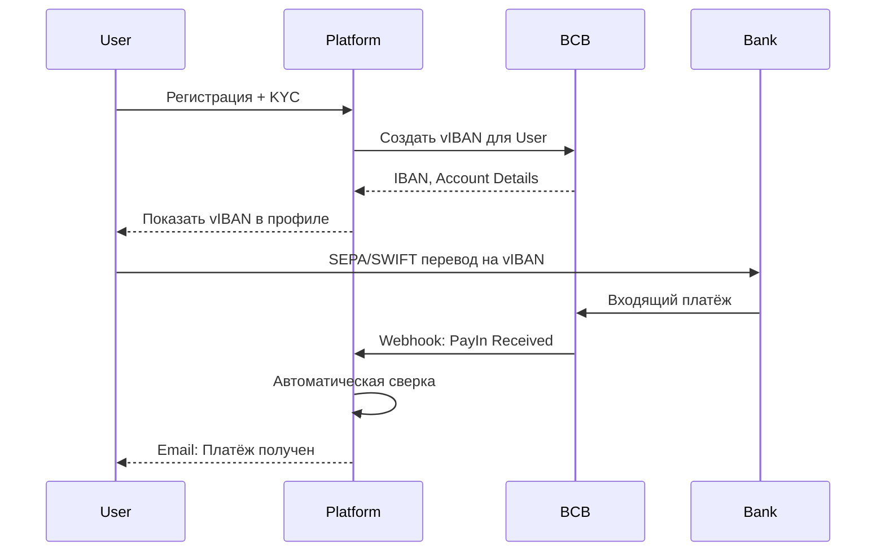

# Virtual IBAN Module - Архитектура и реализация

> **Дата:** 2024-12-01  
> **Версия:** 1.0  
> **Статус:** Design Phase

---

## 📋 Оглавление

1. [Обзор](#обзор)
2. [Бизнес-логика](#бизнес-логика)
3. [Архитектура](#архитектура)
4. [Структура провайдера](#структура-провайдера)
5. [Модель данных](#модель-данных)
6. [API Endpoints](#api-endpoints)
7. [UI Компоненты](#ui-компоненты)
8. [Интеграция с BCB Group](#интеграция-с-bcb-group)
9. [Фазы реализации](#фазы-реализации)

---

## Обзор

### Что такое Virtual IBAN?

Virtual IBAN (vIBAN) — персональный банковский счёт для каждого клиента, который автоматически:
- ✅ Идентифицирует входящие платежи
- ✅ Привязывает платёж к конкретному клиенту и заказу
- ✅ Упрощает reconciliation (сверку платежей)
- ✅ Улучшает UX (один раз получил IBAN, использует постоянно)

### Зачем это нужно?

**Текущая проблема:**
```
Клиент делает банковский перевод →
Админ вручную сверяет по имени/reference →
Риск ошибок и медленная обработка ❌
```

**С Virtual IBAN:**
```
Клиент делает перевод на свой vIBAN →
Система автоматически идентифицирует →
Моментальное обновление статуса заказа ✅
```

### Преимущества

| Для клиента | Для платформы |
|-------------|---------------|
| 🎯 Один IBAN для всех платежей | 🤖 Автоматическая сверка |
| ⚡ Мгновенное подтверждение | 📊 Меньше ручной работы |
| 🔒 Персональный счёт | 💰 Снижение ошибок |
| 📱 Удобный UX | ⏱️ Быстрая обработка |

---

## Бизнес-логика

### User Flow



### Lifecycle vIBAN

```
1. СОЗДАНИЕ (on User Registration)
   ↓
2. АКТИВЕН (ready for deposits)
   ↓
3. ПРИОСТАНОВЛЕН (user suspended / KYC expired)
   ↓
4. ЗАКРЫТ (user deleted / account closed)
```

### Автоматическая сверка

```typescript
Webhook от BCB → {
  accountId: "12345",
  amount: 1000,
  currency: "EUR",
  senderName: "John Doe"
}

↓ Lookup vIBAN

VirtualIbanAccount {
  userId: "user_abc",
  iban: "DE89370400440532013000",
  bcbAccountId: "12345"
}

↓ Найти/создать Order

Order {
  userId: "user_abc",
  fiatAmount: 1000,
  fiatCurrency: "EUR",
  status: PAYMENT_RECEIVED ✅
}
```

---

## Архитектура

### Общая структура

```
┌─────────────────────────────────────────────────────┐
│                   APPLICATION                       │
├─────────────────────────────────────────────────────┤
│                                                     │
│  ┌──────────────────────────────────────────────┐  │
│  │      VirtualIbanService (Core Logic)         │  │
│  │  - createVirtualIban()                       │  │
│  │  - getVirtualIban()                          │  │
│  │  - handleIncomingPayment()                   │  │
│  │  - reconcilePayment()                        │  │
│  └──────────────────────────────────────────────┘  │
│                        ▲                            │
│                        │                            │
│  ┌─────────────────────┴──────────────────────┐    │
│  │      IVirtualIbanProvider (Interface)      │    │
│  │  - createAccount()                         │    │
│  │  - getAccountDetails()                     │    │
│  │  - getTransactions()                       │    │
│  │  - closeAccount()                          │    │
│  └─────────────────────┬──────────────────────┘    │
│                        │                            │
│         ┌──────────────┼──────────────┐             │
│         ▼              ▼              ▼             │
│  ┌───────────┐  ┌──────────┐  ┌──────────┐         │
│  │    BCB    │  │  Curren  │  │  Modular │         │
│  │  Adapter  │  │   xy     │  │  Finance │         │
│  └───────────┘  └──────────┘  └──────────┘         │
│                                                     │
└─────────────────────────────────────────────────────┘
```

### Паттерн Strategy (Multiple Providers)

```typescript
// Выбор провайдера на основе настроек
const provider = IntegrationFactory.getProvider<IVirtualIbanProvider>(
  IntegrationCategory.VIRTUAL_IBAN,
  'BCB_GROUP' // или 'CURRENCYCLOUD', 'MODULR'
);

// Создание vIBAN через выбранного провайдера
const account = await provider.createAccount({
  userId: user.id,
  currency: 'EUR',
  country: 'DE'
});
```

---

## Структура провайдера

### 1. Interface: `IVirtualIbanProvider.ts`

```typescript
/**
 * Virtual IBAN Provider Interface
 * 
 * Standard interface for all Virtual IBAN providers
 * Implementations: BCB Group, Currency Cloud, Modulr, etc.
 */

import { IIntegrationProvider, IntegrationCategory } from '../types';

// ==========================================
// VIRTUAL IBAN TYPES
// ==========================================

/**
 * Account creation request
 */
export interface VirtualIbanCreateRequest {
  userId: string;
  userEmail: string;
  firstName: string;
  lastName: string;
  dateOfBirth: string; // YYYY-MM-DD
  nationality: string; // ISO2
  country: string; // ISO2 - where IBAN will be issued
  currency: string; // EUR, USD, GBP, PLN
  address: {
    street: string;
    city: string;
    postalCode: string;
    country: string; // ISO2
  };
}

/**
 * Virtual IBAN account details
 */
export interface VirtualIbanAccount {
  accountId: string; // Provider's account ID
  userId: string; // Our user ID
  iban: string; // Virtual IBAN
  bic?: string; // BIC/SWIFT code
  bankName: string; // Bank name
  accountHolder: string; // Account holder name
  currency: string; // Account currency
  country: string; // Account country
  status: VirtualIbanStatus;
  balance?: number; // Current balance (if available)
  createdAt: Date;
  metadata?: Record<string, any>;
}

/**
 * Transaction on virtual IBAN
 */
export interface VirtualIbanTransaction {
  transactionId: string;
  accountId: string;
  type: 'credit' | 'debit';
  amount: number;
  currency: string;
  senderName?: string;
  senderIban?: string;
  reference?: string;
  status: 'pending' | 'completed' | 'failed';
  processedAt?: Date;
  metadata?: Record<string, any>;
}

/**
 * Account status
 */
export type VirtualIbanStatus = 'active' | 'suspended' | 'closed';

// ==========================================
// PROVIDER INTERFACE
// ==========================================

export interface IVirtualIbanProvider extends IIntegrationProvider {
  readonly category: IntegrationCategory.VIRTUAL_IBAN;

  /**
   * Create a new virtual IBAN account for user
   */
  createAccount(request: VirtualIbanCreateRequest): Promise<VirtualIbanAccount>;

  /**
   * Get account details by account ID
   */
  getAccountDetails(accountId: string): Promise<VirtualIbanAccount>;

  /**
   * Get transactions for account
   */
  getTransactions(
    accountId: string,
    startDate?: Date,
    endDate?: Date
  ): Promise<VirtualIbanTransaction[]>;

  /**
   * Get account balance
   */
  getBalance(accountId: string): Promise<{
    balance: number;
    currency: string;
    availableBalance?: number;
  }>;

  /**
   * Suspend account (temporary block)
   */
  suspendAccount(accountId: string, reason?: string): Promise<{ success: boolean }>;

  /**
   * Reactivate suspended account
   */
  reactivateAccount(accountId: string): Promise<{ success: boolean }>;

  /**
   * Close account permanently
   */
  closeAccount(accountId: string, reason?: string): Promise<{ success: boolean }>;

  /**
   * Verify webhook signature (for automatic payment notifications)
   */
  verifyWebhookSignature?(payload: string, signature: string): boolean;

  /**
   * Process webhook payload (normalize data)
   */
  processWebhook?(payload: any): {
    accountId: string;
    transactionId: string;
    type: 'credit' | 'debit';
    amount: number;
    currency: string;
    senderName?: string;
    reference?: string;
    metadata?: Record<string, any>;
  };
}
```

### 2. Implementation: `BCBGroupAdapter.ts`

```typescript
/**
 * BCB Group Virtual IBAN Adapter
 * 
 * Implements Virtual IBAN functionality using BCB Group API
 */

import {
  IVirtualIbanProvider,
  VirtualIbanCreateRequest,
  VirtualIbanAccount,
  VirtualIbanTransaction,
  VirtualIbanStatus,
} from '../../categories/IVirtualIbanProvider';
import { IntegrationCategory } from '../../types';

export class BCBGroupAdapter implements IVirtualIbanProvider {
  readonly category = IntegrationCategory.VIRTUAL_IBAN as const;
  readonly name = 'BCB Group';

  private baseUrl: string;
  private authUrl: string;
  private clientId: string;
  private clientSecret: string;
  private counterpartyId: string;
  private cid: string;
  private token: string | null = null;

  constructor(config: {
    sandbox?: boolean;
    clientId: string;
    clientSecret: string;
    counterpartyId: string;
    cid: string;
  }) {
    this.baseUrl = config.sandbox 
      ? 'https://api.sandbox.bcb.group' 
      : 'https://api.bcb.group';
    this.authUrl = 'https://auth.bcb.group';
    this.clientId = config.clientId;
    this.clientSecret = config.clientSecret;
    this.counterpartyId = config.counterpartyId;
    this.cid = config.cid;
  }

  // ==========================================
  // AUTHENTICATION
  // ==========================================

  private async authenticate(): Promise<string> {
    const response = await fetch(`${this.authUrl}/oauth/token`, {
      method: 'POST',
      headers: { 'Content-Type': 'application/json' },
      body: JSON.stringify({
        client_id: this.clientId,
        client_secret: this.clientSecret,
      }),
    });

    if (!response.ok) {
      throw new Error(`BCB authentication failed: ${response.statusText}`);
    }

    const data = await response.json();
    this.token = data.access_token;
    return this.token;
  }

  private async request<T>(
    method: string,
    endpoint: string,
    body?: any
  ): Promise<T> {
    if (!this.token) {
      await this.authenticate();
    }

    const response = await fetch(`${this.baseUrl}${endpoint}`, {
      method,
      headers: {
        'Authorization': `Bearer ${this.token}`,
        'Content-Type': 'application/json',
      },
      body: body ? JSON.stringify(body) : undefined,
    });

    // Re-auth on 401
    if (response.status === 401) {
      await this.authenticate();
      return this.request(method, endpoint, body);
    }

    if (!response.ok) {
      const error = await response.text();
      throw new Error(`BCB request failed: ${response.status} ${error}`);
    }

    return response.json();
  }

  // ==========================================
  // PROVIDER IMPLEMENTATION
  // ==========================================

  async createAccount(
    request: VirtualIbanCreateRequest
  ): Promise<VirtualIbanAccount> {
    // BCB Group v4 - Create bank account for user
    const payload = {
      counterparty_id: this.counterpartyId,
      cid: this.cid,
      name: `${request.firstName} ${request.lastName} ${request.currency} Account`,
      account_type: 'Bank',
      ccy: request.currency,
      host_country: request.country,
      node_name: `${request.firstName} ${request.lastName}`,
      node_location_line_1: request.address.street,
      node_location_city: request.address.city,
      node_location_postcode: request.address.postalCode,
      node_country: request.address.country,
      node_type: 'individual',
      bcb_controlled: 1,
      is_beneficiary: 0, // This is OUR account, not beneficiary
      // Link to user
      external_id: request.userId,
    };

    // For EUR: IBAN will be auto-generated by BCB
    if (request.currency === 'EUR') {
      payload.iban = null; // BCB will assign
    }

    const bcbAccount = await this.request<any>('POST', '/v4/accounts', payload);

    return {
      accountId: bcbAccount.id.toString(),
      userId: request.userId,
      iban: bcbAccount.iban,
      bic: bcbAccount.bic,
      bankName: bcbAccount.host_name || 'BCB Partner Bank',
      accountHolder: bcbAccount.node_name,
      currency: request.currency,
      country: request.country,
      status: 'active',
      createdAt: new Date(bcbAccount.created_at),
      metadata: {
        aid: bcbAccount.aid,
        bcb_controlled: bcbAccount.bcb_controlled,
        blinc_id: bcbAccount.blinc_id,
      },
    };
  }

  async getAccountDetails(accountId: string): Promise<VirtualIbanAccount> {
    const bcbAccount = await this.request<any>('GET', `/v3/accounts/${accountId}`);

    return {
      accountId: bcbAccount.id.toString(),
      userId: bcbAccount.external_id || '',
      iban: bcbAccount.iban,
      bic: bcbAccount.bic,
      bankName: bcbAccount.host_name,
      accountHolder: bcbAccount.node_name,
      currency: bcbAccount.ccy,
      country: bcbAccount.host_country,
      status: this.mapBCBStatus(bcbAccount),
      createdAt: new Date(bcbAccount.created_at),
      metadata: { aid: bcbAccount.aid },
    };
  }

  async getTransactions(
    accountId: string,
    startDate?: Date,
    endDate?: Date
  ): Promise<VirtualIbanTransaction[]> {
    const bcbTransactions = await this.request<any[]>(
      'GET',
      `/v3/accounts/${accountId}/transactions`
    );

    return bcbTransactions.map((tx) => ({
      transactionId: tx.tx_id,
      accountId: accountId,
      type: tx.credit === 1 ? 'credit' : 'debit',
      amount: parseFloat(tx.amount),
      currency: tx.ticker,
      senderName: tx.details,
      reference: tx.notes,
      status: tx.approved === 1 ? 'completed' : 'pending',
      processedAt: new Date(tx.value_date),
      metadata: {
        source: tx.source_name,
        network: tx.network,
      },
    }));
  }

  async getBalance(accountId: string): Promise<{
    balance: number;
    currency: string;
    availableBalance?: number;
  }> {
    const balanceData = await this.request<any>(
      'GET',
      `/v3/accounts/${accountId}/balance`
    );

    return {
      balance: parseFloat(balanceData.balance),
      currency: balanceData.ticker,
      availableBalance: parseFloat(balanceData.balance),
    };
  }

  async suspendAccount(accountId: string, reason?: string): Promise<{ success: boolean }> {
    // BCB doesn't have direct suspend API - we'll track this in our DB
    // Could potentially use metadata field to mark as suspended
    console.warn('BCB Group: Account suspension not directly supported - tracked in local DB');
    return { success: true };
  }

  async reactivateAccount(accountId: string): Promise<{ success: boolean }> {
    console.warn('BCB Group: Account reactivation not directly supported - tracked in local DB');
    return { success: true };
  }

  async closeAccount(accountId: string, reason?: string): Promise<{ success: boolean }> {
    // BCB might not support account closure via API
    // Typically done manually or kept as inactive
    console.warn('BCB Group: Account closure should be handled manually with BCB support');
    return { success: true };
  }

  // ==========================================
  // WEBHOOKS
  // ==========================================

  verifyWebhookSignature(payload: string, signature: string): boolean {
    // BCB webhook signature verification
    // TODO: Implement BCB-specific signature verification
    return true;
  }

  processWebhook(payload: any): {
    accountId: string;
    transactionId: string;
    type: 'credit' | 'debit';
    amount: number;
    currency: string;
    senderName?: string;
    reference?: string;
    metadata?: Record<string, any>;
  } {
    // BCB webhook format: payment.status event
    const event = payload[0]; // BCB sends array

    return {
      accountId: event.account_id?.toString() || '',
      transactionId: event.transactionId || event.endToEndIdentification,
      type: event.credit === 1 ? 'credit' : 'debit',
      amount: parseFloat(event.amount || 0),
      currency: event.ccy || event.currency,
      senderName: event.sender_name || event.details,
      reference: event.reference || event.nonce,
      metadata: {
        e2eId: event.endToEndIdentification,
        response: event.response,
        network: event.network,
      },
    };
  }

  // ==========================================
  // UTILITY
  // ==========================================

  async testConnection(): Promise<boolean> {
    try {
      await this.authenticate();
      return true;
    } catch (error) {
      console.error('BCB connection test failed:', error);
      return false;
    }
  }

  private mapBCBStatus(bcbAccount: any): VirtualIbanStatus {
    // BCB doesn't have explicit status field
    // We infer from metadata or our local tracking
    return 'active';
  }
}
```

---

## Модель данных

### Prisma Schema

```prisma
// ==========================================
// VIRTUAL IBAN MODULE
// ==========================================

model VirtualIbanAccount {
  id                String              @id @default(cuid())
  
  // User relationship
  userId            String
  user              User                @relation(fields: [userId], references: [id], onDelete: Cascade)
  
  // Provider info
  providerId        String              // 'BCB_GROUP', 'CURRENCYCLOUD', etc.
  providerAccountId String              // Provider's internal account ID
  
  // Bank details
  iban              String              @unique
  bic               String?
  bankName          String
  accountHolder     String
  currency          String              // EUR, USD, GBP, PLN
  country           String              // ISO2 country code
  
  // Status
  status            VirtualIbanStatus   @default(ACTIVE)
  suspendedReason   String?
  closedReason      String?
  
  // Balance tracking (optional, synced from provider)
  balance           Float?
  lastBalanceSync   DateTime?
  
  // Metadata
  metadata          Json?               // Provider-specific data
  
  // Timestamps
  createdAt         DateTime            @default(now())
  updatedAt         DateTime            @updatedAt
  closedAt          DateTime?
  
  // Relations
  transactions      VirtualIbanTransaction[]
  payIns            PayIn[]             @relation("VirtualIbanPayIns")
  
  @@index([userId])
  @@index([iban])
  @@index([providerId])
  @@index([status])
  @@index([currency])
}

model VirtualIbanTransaction {
  id                  String              @id @default(cuid())
  
  // Account relationship
  virtualIbanId       String
  virtualIban         VirtualIbanAccount  @relation(fields: [virtualIbanId], references: [id], onDelete: Cascade)
  
  // Provider info
  providerTxId        String              @unique  // Provider's transaction ID
  providerId          String              // 'BCB_GROUP', etc.
  
  // Transaction details
  type                TransactionType     // CREDIT or DEBIT
  amount              Float
  currency            String
  
  // Sender/Recipient info
  senderName          String?
  senderIban          String?
  senderBank          String?
  reference           String?
  
  // Status
  status              VirtualIbanTxStatus @default(PENDING)
  
  // Reconciliation
  orderId             String?             // Linked order
  order               Order?              @relation(fields: [orderId], references: [id])
  payInId             String?             // Linked PayIn
  payIn               PayIn?              @relation("VirtualIbanTxToPayIn", fields: [payInId], references: [id])
  
  reconciledAt        DateTime?
  reconciledBy        String?
  
  // Metadata
  metadata            Json?
  
  // Timestamps
  processedAt         DateTime?
  createdAt           DateTime            @default(now())
  updatedAt           DateTime            @updatedAt
  
  @@index([virtualIbanId])
  @@index([providerTxId])
  @@index([orderId])
  @@index([payInId])
  @@index([status])
  @@index([type])
  @@index([processedAt])
}

// Update existing models

model User {
  // ... existing fields ...
  virtualIbanAccounts VirtualIbanAccount[]
}

model PayIn {
  // ... existing fields ...
  virtualIbanId       String?
  virtualIban         VirtualIbanAccount? @relation("VirtualIbanPayIns", fields: [virtualIbanId], references: [id])
  virtualIbanTxId     String?
  virtualIbanTx       VirtualIbanTransaction? @relation("VirtualIbanTxToPayIn")
}

model Order {
  // ... existing fields ...
  virtualIbanTxs      VirtualIbanTransaction[]
}

// Enums

enum VirtualIbanStatus {
  ACTIVE
  SUSPENDED
  CLOSED
}

enum TransactionType {
  CREDIT
  DEBIT
}

enum VirtualIbanTxStatus {
  PENDING
  COMPLETED
  FAILED
  REFUNDED
}
```

---

## API Endpoints

### Admin API

```typescript
// POST /api/admin/virtual-iban/create
// Create virtual IBAN for user
{
  "userId": "user_abc",
  "currency": "EUR",
  "country": "DE"
}

// GET /api/admin/virtual-iban/accounts
// List all virtual IBANs
Query params: ?userId, ?status, ?currency

// GET /api/admin/virtual-iban/:id
// Get account details

// POST /api/admin/virtual-iban/:id/suspend
// Suspend account
{
  "reason": "KYC expired"
}

// POST /api/admin/virtual-iban/:id/reactivate
// Reactivate account

// POST /api/admin/virtual-iban/:id/close
// Close account permanently
{
  "reason": "User requested closure"
}

// GET /api/admin/virtual-iban/:id/transactions
// Get transactions for account
Query params: ?startDate, ?endDate

// POST /api/admin/virtual-iban/reconcile
// Manual reconciliation
{
  "transactionId": "tx_abc",
  "orderId": "order_xyz"
}
```

### Client API

```typescript
// GET /api/client/virtual-iban/my-accounts
// Get user's virtual IBANs
Response: [
  {
    "id": "viban_abc",
    "iban": "DE89370400440532013000",
    "bic": "COBADEFFXXX",
    "bankName": "BCB Partner Bank",
    "currency": "EUR",
    "status": "active",
    "balance": 1250.50,
    "createdAt": "2024-01-01T00:00:00Z"
  }
]

// GET /api/client/virtual-iban/:id/transactions
// Get transactions for user's account
Query params: ?page, ?limit

// POST /api/client/virtual-iban/request
// Request new virtual IBAN
{
  "currency": "EUR",
  "country": "DE"
}
```

### Webhook Endpoint

```typescript
// POST /api/webhooks/bcb/virtual-iban
// BCB Group webhook for incoming payments
Headers: {
  "X-BCB-Signature": "sha256=..."
}

Body: [
  {
    "endToEndIdentification": "E2E-ABC123",
    "transactionId": "TXN-DEF456",
    "account_id": 12345,
    "credit": 1,
    "amount": "1000.00",
    "ccy": "EUR",
    "sender_name": "John Doe",
    "reference": "Payment for order",
    "response": "Complete"
  }
]

→ Auto-reconcile with Order
→ Update PayIn status
→ Send email notification
```

---

## UI Компоненты

### Admin Panel

1. **Virtual IBAN Management Page** (`/admin/virtual-iban`)
   - List of all virtual IBANs
   - Filters: User, Status, Currency
   - Actions: View, Suspend, Close
   - Create new vIBAN button

2. **Account Details Modal**
   - IBAN, BIC, Bank details
   - Current balance
   - Transaction history
   - Reconciliation status

3. **Reconciliation Tool**
   - Unreconciled transactions list
   - Manual matching with orders
   - Bulk operations

### Client Panel

1. **My Virtual IBANs Page** (`/client/virtual-iban`)
   - Card display of each vIBAN
   - Copy IBAN button
   - Download payment instructions PDF
   - Request new vIBAN (if allowed)

2. **IBAN Details Component**
   ```tsx
   <VirtualIbanCard
     iban="DE89370400440532013000"
     bic="COBADEFFXXX"
     bankName="BCB Partner Bank"
     currency="EUR"
     balance={1250.50}
     status="active"
   />
   ```

3. **Transaction History**
   - Filterable list
   - Export to CSV
   - Status badges

---

## Интеграция с BCB Group

### Настройка

```typescript
// .env
BCB_SANDBOX=true
BCB_CLIENT_ID=your_client_id
BCB_CLIENT_SECRET=your_client_secret
BCB_COUNTERPARTY_ID=12345
BCB_CID=CID-XYZ789
```

### Workflow

```typescript
// 1. User registers + completes KYC
const user = await createUser({ ... });
await completeKyc(user.id);

// 2. Auto-create virtual IBAN
const virtualIban = await virtualIbanService.createVirtualIban({
  userId: user.id,
  currency: 'EUR',
  country: 'DE',
  providerId: 'BCB_GROUP'
});

// 3. User sees IBAN in profile
// 4. User makes SEPA transfer to IBAN

// 5. BCB sends webhook
app.post('/api/webhooks/bcb/virtual-iban', async (req, res) => {
  const webhook = bcbAdapter.processWebhook(req.body);
  
  await virtualIbanService.handleIncomingPayment({
    virtualIbanId: webhook.accountId,
    transactionId: webhook.transactionId,
    amount: webhook.amount,
    currency: webhook.currency,
    senderName: webhook.senderName,
    reference: webhook.reference
  });
  
  res.json({ success: true });
});

// 6. Auto-reconciliation
await orderService.reconcilePayment({
  userId: virtualIban.userId,
  amount: webhook.amount,
  currency: webhook.currency,
  reference: webhook.reference
});

// 7. Email notification
await sendEmail({
  to: user.email,
  template: 'payment-received',
  data: { amount, currency, orderId }
});
```

---

## Фазы реализации

### Phase 1: Core Infrastructure (Week 1-2)
- ✅ Create `IVirtualIbanProvider` interface
- ✅ Implement `BCBGroupAdapter`
- ✅ Add Prisma models
- ✅ Create `VirtualIbanService`
- ✅ Add integration to `IntegrationRegistry`

### Phase 2: API Endpoints (Week 2-3)
- ✅ Admin endpoints (CRUD)
- ✅ Client endpoints (read-only)
- ✅ Webhook endpoint
- ✅ Authentication & authorization

### Phase 3: Auto-reconciliation (Week 3-4)
- ✅ Webhook processing logic
- ✅ Order matching algorithm
- ✅ PayIn creation/update
- ✅ Notification triggers

### Phase 4: UI Components (Week 4-5)
- ✅ Admin management page
- ✅ Client vIBAN display
- ✅ Transaction history
- ✅ PDF generation (payment instructions)

### Phase 5: Testing & Polish (Week 5-6)
- ✅ Unit tests
- ✅ Integration tests
- ✅ BCB sandbox testing
- ✅ Error handling
- ✅ Documentation

### Phase 6: Production Deployment (Week 6)
- ✅ Production BCB credentials
- ✅ Migration script for existing users
- ✅ Monitoring & alerts
- ✅ User communication (email, docs)

---

## Next Steps

1. **Review & Approve Architecture**
2. **Setup BCB Sandbox Account**
3. **Start Phase 1 Implementation**
4. **Create detailed task breakdown**

---

## Questions to Answer

- [ ] Auto-create vIBAN on user registration or manual request?
- [ ] Support multiple currencies per user (multiple vIBANs)?
- [ ] Minimum KYC level required for vIBAN?
- [ ] Fee structure for vIBAN maintenance?
- [ ] Automatic vIBAN closure rules (inactivity, user deletion)?

---

**Ready to implement? 🚀**


