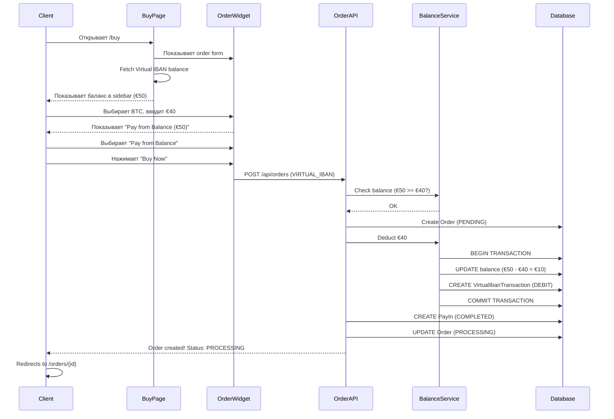

# Virtual IBAN - Client Flow Implementation

> **Status:** 🟡 **В ПРОЦЕССЕ** (Phase 1-4 из 7 завершены)  
> **Date:** December 1, 2025

---

## ✅ Что уже работает

### 1. VirtualIbanCard Component (`src/components/features/VirtualIbanCard.tsx`)

**Функции:**
- ✅ Показ текущего баланса Virtual IBAN
- ✅ Отображение IBAN + BIC (с маскировкой)
- ✅ Кнопка "Copy to clipboard" для IBAN/BIC
- ✅ Кнопка "Get Virtual IBAN" (если еще нет)
- ✅ Link на `/payment-details` (top-up + transactions)
- ✅ Compact mode для sidebar
- ✅ Full mode для standalone pages

**Режимы:**
- **Compact** - для sidebar на `/buy` странице
- **Full** - для отдельной страницы (уже используется в `/payment-details`)

### 2. API Endpoint `/api/client/virtual-iban/create`

**Функционал:**
- ✅ POST request для создания Virtual IBAN
- ✅ Проверка существующего счета (защита от дубликатов)
- ✅ Авторизация через `requireAuth()`
- ✅ Вызов `virtualIbanService.createAccountForUser(userId)`

### 3. Integration в `/buy` Page

**Изменения:**
- ✅ Импорт `VirtualIbanCard`
- ✅ Размещение в sidebar (выше "Why Choose Us")
- ✅ Conditional rendering (только для KYC verified)
- ✅ Compact mode для экономии места

**Пример:**
```tsx
{/* Virtual IBAN Card */}
{(!kycStatus?.kycRequired || kycStatus?.isApproved) && (
  <VirtualIbanCard compact />
)}
```

### 4. Payment Method в БД

**Details:**
```sql
Code: VIRTUAL_IBAN
Name: Virtual IBAN Balance
Type: VIRTUAL_IBAN
Currency: EUR
ProviderType: PSP
AutomationLevel: FULLY_AUTO
Processing: instant
Fee: 0%
Min Amount: €1
Max Amount: €999,999
```

**Script:** `scripts/add-virtual-iban-payment-method.ts`

---

## ⏳ Что осталось сделать

### 5. Обновить ClientOrderWidget

**TODO:**
```typescript
// src/components/features/ClientOrderWidget.tsx

// 1. Fetch Virtual IBAN balance
const [virtualIbanBalance, setVirtualIbanBalance] = useState<number | null>(null);

useEffect(() => {
  const fetchVirtualIban = async () => {
    const response = await fetch('/api/client/virtual-iban');
    const data = await response.json();
    if (data.success && data.data.length > 0) {
      setVirtualIbanBalance(data.data[0].balance);
    }
  };
  fetchVirtualIban();
}, []);

// 2. Show VIRTUAL_IBAN payment method if balance >= totalFiat
{virtualIbanBalance && virtualIbanBalance >= totalFiat && (
  <div className="payment-method-option">
    <input 
      type="radio" 
      value="VIRTUAL_IBAN" 
      checked={selectedPaymentMethod === 'VIRTUAL_IBAN'}
      onChange={() => setSelectedPaymentMethod('VIRTUAL_IBAN')}
    />
    <label>
      💳 Pay from Balance (€{virtualIbanBalance.toFixed(2)})
      <Badge>Instant</Badge>
    </label>
  </div>
)}

// 3. Hide bank transfer instructions if VIRTUAL_IBAN selected
{selectedPaymentMethod !== 'VIRTUAL_IBAN' && (
  <div className="bank-transfer-instructions">
    {/* ... existing instructions ... */}
  </div>
)}
```

### 6. Обновить API `/api/orders`

**TODO:**
```typescript
// src/app/api/orders/route.ts

// After order creation, check if payment method is VIRTUAL_IBAN
if (validatedData.paymentMethodCode === 'VIRTUAL_IBAN') {
  // 1. Get user's Virtual IBAN account
  const virtualIbanAccounts = await virtualIbanService.getUserAccounts(userId);
  if (virtualIbanAccounts.length === 0) {
    return NextResponse.json({ error: 'Virtual IBAN not found' }, { status: 400 });
  }
  const account = virtualIbanAccounts[0];

  // 2. Check sufficient balance
  if (account.balance < calculation.totalFiat) {
    return NextResponse.json({ 
      error: 'Insufficient balance', 
      required: calculation.totalFiat,
      available: account.balance
    }, { status: 400 });
  }

  // 3. Deduct balance atomically
  await virtualIbanService.deductBalance(
    account.id, 
    calculation.totalFiat,
    order.id,
    'ORDER_PAYMENT'
  );

  // 4. Create PayIn record (instant)
  await prisma.payIn.create({
    data: {
      orderId: order.id,
      userId,
      amount: calculation.totalFiat,
      expectedAmount: calculation.totalFiat,
      receivedAmount: calculation.totalFiat,
      fiatCurrencyCode: validatedData.fiatCurrencyCode,
      currencyType: 'FIAT',
      status: 'COMPLETED',
      paymentMethodCode: 'VIRTUAL_IBAN',
      transactionId: `VIBAN-${order.id}`,
      paymentDate: new Date(),
      receivedDate: new Date(),
      initiatedAt: new Date(),
      initiatedBy: userId,
    }
  });

  // 5. Update Order status to PROCESSING (payment received)
  await prisma.order.update({
    where: { id: order.id },
    data: { 
      status: 'PROCESSING',
      processedAt: new Date()
    }
  });
}
```

### 7. Virtual IBAN Balance Deduction Service

**TODO:** Create `src/lib/services/virtual-iban-balance.service.ts`

```typescript
/**
 * Virtual IBAN Balance Management Service
 * 
 * Handles atomic balance operations:
 * - Check balance
 * - Deduct balance
 * - Create transaction record
 * - Link to Order + PayIn
 */

export class VirtualIbanBalanceService {
  /**
   * Deduct balance from Virtual IBAN account (atomic transaction)
   * @param accountId Virtual IBAN account ID
   * @param amount Amount to deduct
   * @param orderId Order ID (for linking)
   * @param description Transaction description
   * @returns Updated account
   */
  async deductBalance(
    accountId: string,
    amount: number,
    orderId: string,
    description: string
  ): Promise<VirtualIbanAccount> {
    return await prisma.$transaction(async (tx) => {
      // 1. Lock account and check balance
      const account = await tx.virtualIbanAccount.findUnique({
        where: { id: accountId }
      });

      if (!account) {
        throw new Error('Virtual IBAN account not found');
      }

      if (account.balance < amount) {
        throw new Error('Insufficient balance');
      }

      // 2. Deduct balance
      const updatedAccount = await tx.virtualIbanAccount.update({
        where: { id: accountId },
        data: {
          balance: { decrement: amount },
          lastBalanceUpdate: new Date(),
        }
      });

      // 3. Create transaction record (DEBIT)
      await tx.virtualIbanTransaction.create({
        data: {
          virtualIbanAccountId: accountId,
          type: 'DEBIT',
          status: 'COMPLETED',
          amount: amount,
          currencyCode: account.currency,
          description: description,
          orderId: orderId,
          processedAt: new Date(),
        }
      });

      return updatedAccount;
    });
  }

  /**
   * Add balance to Virtual IBAN account (for top-ups)
   * @param accountId Virtual IBAN account ID
   * @param amount Amount to add
   * @param transactionId External transaction ID
   * @param reference Payment reference
   * @returns Updated account
   */
  async addBalance(
    accountId: string,
    amount: number,
    transactionId: string,
    reference: string
  ): Promise<VirtualIbanAccount> {
    return await prisma.$transaction(async (tx) => {
      // 1. Add balance
      const updatedAccount = await tx.virtualIbanAccount.update({
        where: { id: accountId },
        data: {
          balance: { increment: amount },
          lastBalanceUpdate: new Date(),
        }
      });

      // 2. Create transaction record (CREDIT)
      await tx.virtualIbanTransaction.create({
        data: {
          virtualIbanAccountId: accountId,
          externalTransactionId: transactionId,
          type: 'CREDIT',
          status: 'COMPLETED',
          amount: amount,
          currencyCode: updatedAccount.currency,
          reference: reference,
          description: 'Bank transfer top-up',
          processedAt: new Date(),
        }
      });

      return updatedAccount;
    });
  }
}

export const virtualIbanBalanceService = new VirtualIbanBalanceService();
```

---

## 🎯 Client User Flow (после завершения)



---

## 📊 Database Changes

### VirtualIbanTransaction updates

When client pays from balance, create transaction:

```sql
INSERT INTO VirtualIbanTransaction (
  virtualIbanAccountId,
  type,
  status,
  amount,
  currencyCode,
  description,
  orderId,
  payInId,
  processedAt
) VALUES (
  '{accountId}',
  'DEBIT',
  'COMPLETED',
  40.00,
  'EUR',
  'ORDER_PAYMENT',
  '{orderId}',
  '{payInId}',
  NOW()
);
```

### Order status flow

```
PENDING (created)
  ↓ (if VIRTUAL_IBAN payment)
PROCESSING (balance deducted, payment received)
  ↓ (admin sends crypto)
COMPLETED
```

---

## 🚀 Testing Checklist

### Manual Testing:

- [ ] **Create Virtual IBAN**
  - [ ] Click "Get Virtual IBAN" button
  - [ ] Verify IBAN appears in sidebar
  - [ ] Verify balance is €0

- [ ] **Top-up Balance** (via admin or webhook simulation)
  - [ ] Add €100 to balance
  - [ ] Verify balance updates in sidebar

- [ ] **Make Purchase with Balance**
  - [ ] Select BTC, enter €40
  - [ ] Verify "Pay from Balance (€100)" appears
  - [ ] Select VIRTUAL_IBAN payment method
  - [ ] Click "Buy Now"
  - [ ] Verify balance drops to €60
  - [ ] Verify Order status = PROCESSING (not PENDING!)
  - [ ] Verify PayIn record created (status=COMPLETED)
  - [ ] Verify VirtualIbanTransaction created (type=DEBIT)

- [ ] **Insufficient Balance**
  - [ ] Balance: €10
  - [ ] Try to buy €40
  - [ ] Verify error: "Insufficient balance"

- [ ] **No Virtual IBAN**
  - [ ] User without IBAN
  - [ ] Verify VIRTUAL_IBAN option not shown
  - [ ] Only bank transfer shown

---

## 📝 Next Steps

1. ✅ **Phase 1-4 завершены** (это сообщение)
2. ⏳ **Phase 5**: Обновить ClientOrderWidget
3. ⏳ **Phase 6**: Обновить API /api/orders
4. ⏳ **Phase 7**: Virtual IBAN Balance Service
5. ⏳ **Phase 8**: Testing & Bug fixes

---

## 💡 Key Features

### Advantages:

- ✅ **Instant payments** - no waiting for bank transfers
- ✅ **Zero fees** - internal balance transfer
- ✅ **Atomic transactions** - balance deduction is instant and safe
- ✅ **Auto-processing** - orders go directly to PROCESSING status
- ✅ **Better UX** - one-click purchases

### Security:

- ✅ Atomic transactions (balance check + deduct)
- ✅ Insufficient balance protection
- ✅ Authorization checks
- ✅ Transaction logging (audit trail)
- ✅ Double-spend protection

---

**Status:** 🟡 **60% завершено** | **Готов к Phase 5-7**


