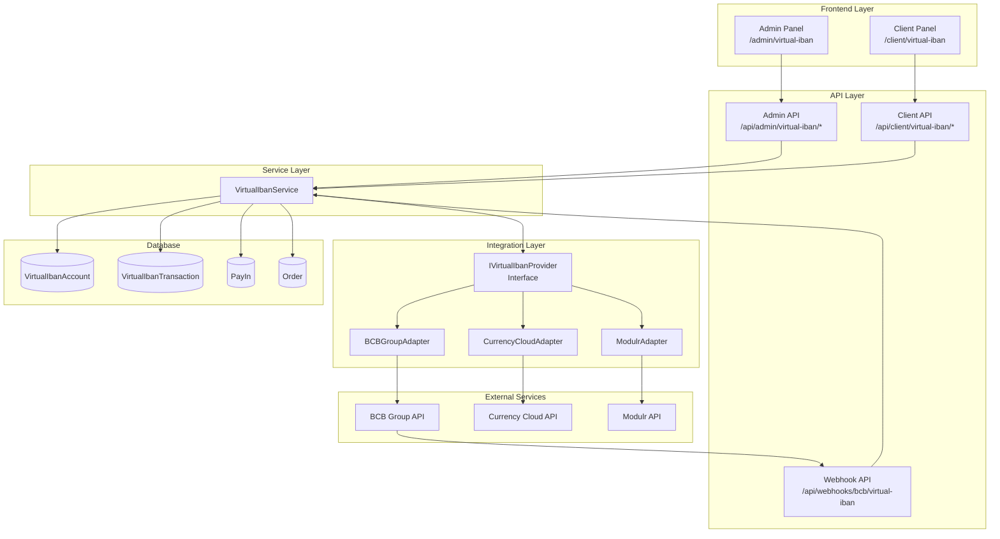
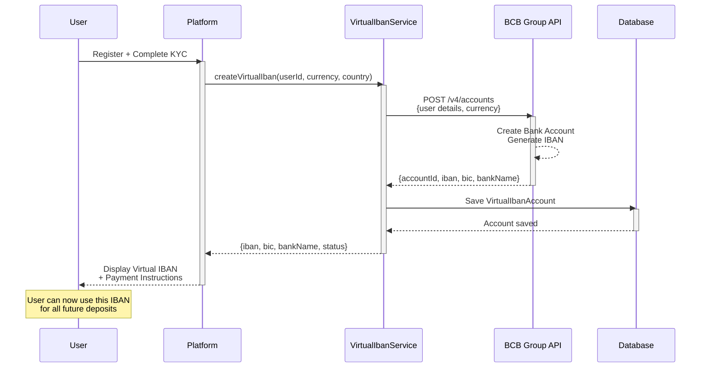
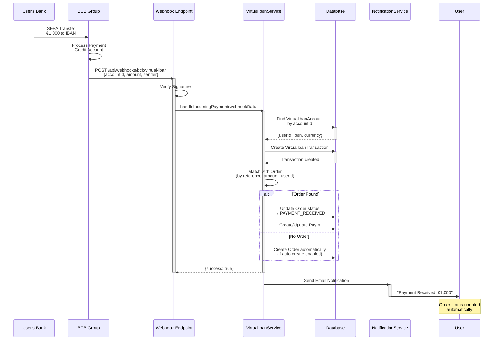
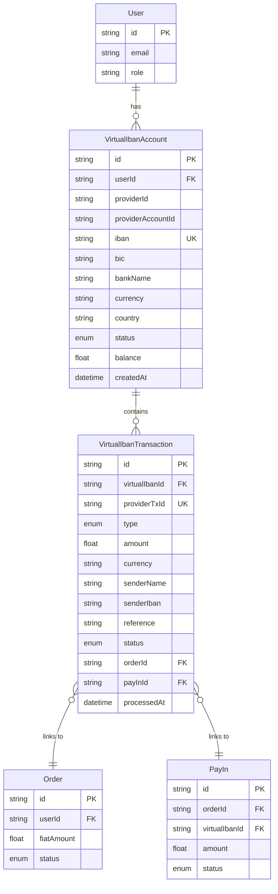
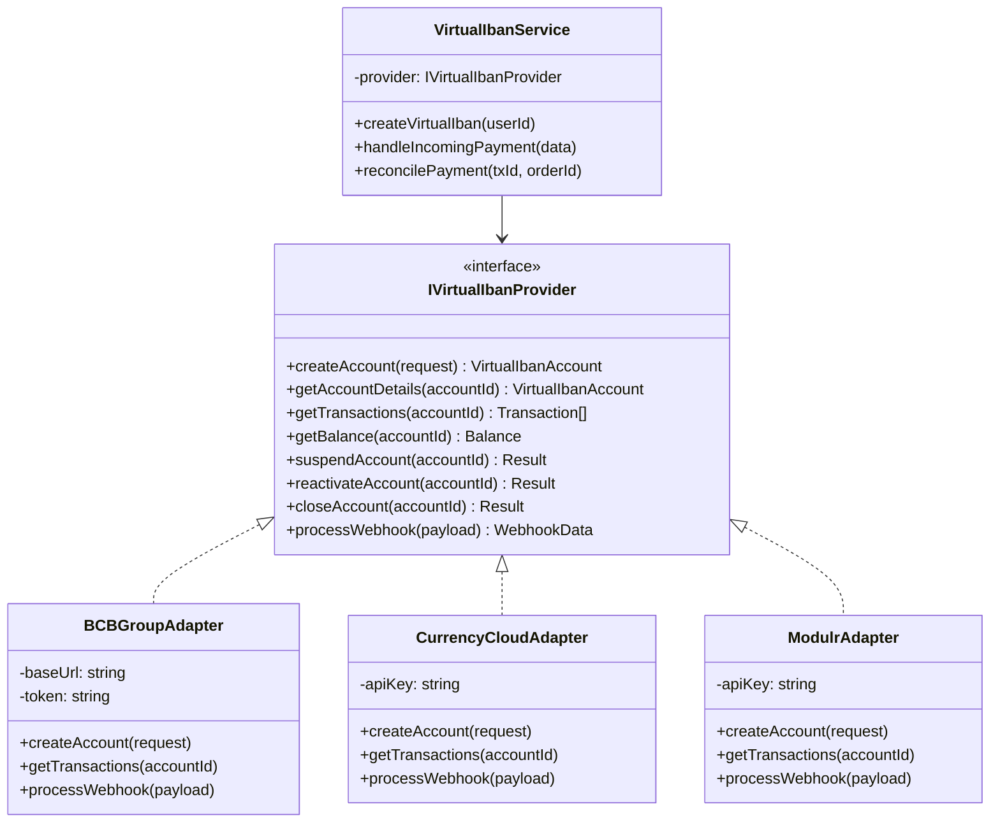
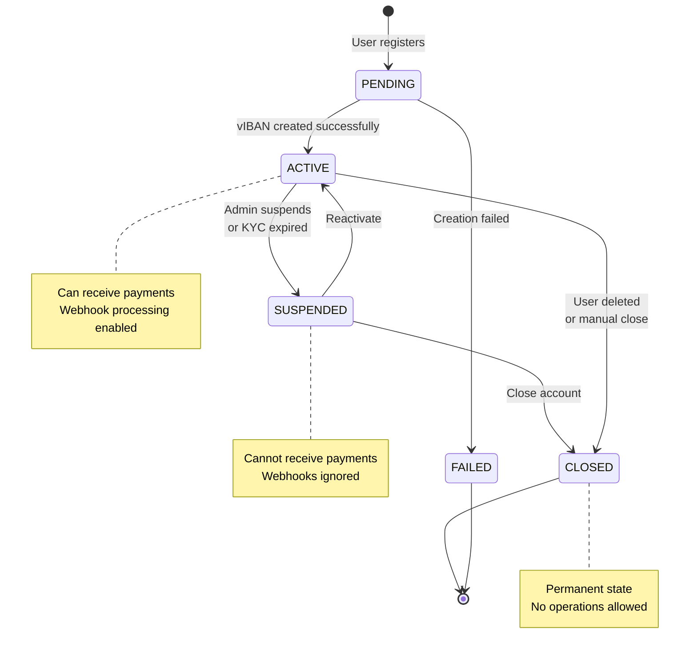
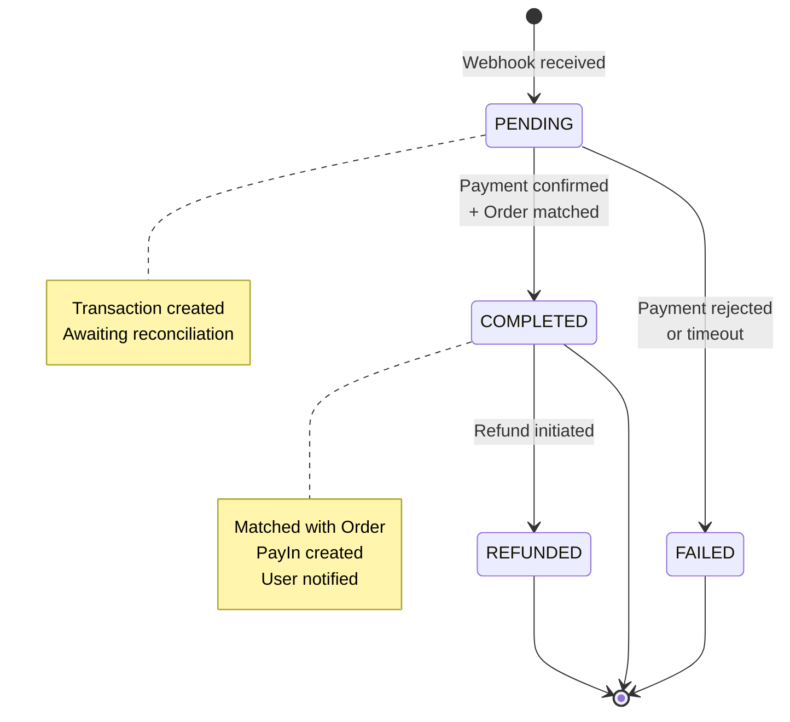
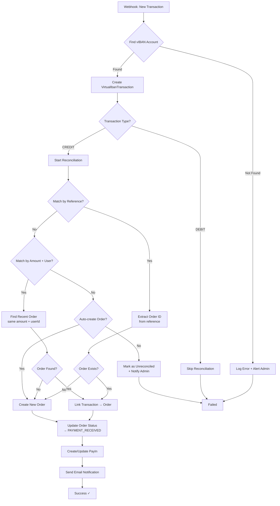
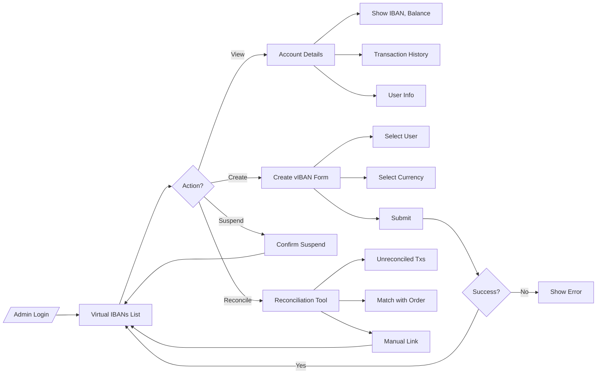
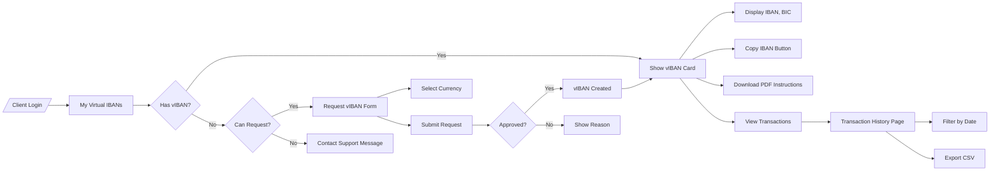

# Virtual IBAN - Диаграммы и визуализация

## 1. Архитектура системы

## 2. User Flow - Создание Virtual IBAN

## 3. Payment Flow - Webhook и Auto-reconciliation

## 4. Data Model Relationships

## 5. Provider Strategy Pattern

## 6. State Machine - Virtual IBAN Status

## 7. Transaction Status Flow

## 8. Reconciliation Algorithm

## 9. Admin Panel UI Flow

## 10. Client Panel UI Flow

---

## Легенда

### Цвета (если поддерживаются)

- 🟢 **Зелёный** - Success states
- 🔴 **Красный** - Error states
- 🟡 **Жёлтый** - Pending/Waiting states
- 🔵 **Синий** - Active processing states

### Обозначения

- `→` - Sync call
- `⇢` - Async call / Event
- `◆` - Decision point
- `□` - Process/Action
- `○` - State
- `⬢` - External service

---

**Эти диаграммы можно использовать в:**
- Technical documentation
- Team presentations
- Client demos
- Code reviews
- Onboarding new developers

